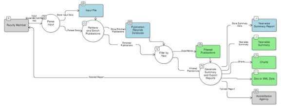
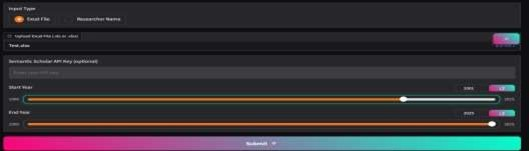

# 📚 Publication Summary Generator for Faculty Members

## Overview
Faculty members and academic institutions often require year-wise summaries of research publications for academic evaluation, accreditation, and professional profile building. Preparing these reports manually by collecting data from platforms such as Google Scholar or DBLP is time-consuming, repetitive, and prone to human error. Existing solutions also provide limited functionality and lack easy integration with standard academic formats like Word and Excel.

The **Publication Summary Generator for Faculty Members** is an automated system designed to collect, clean, enrich, analyze, visualize, and export research publication data efficiently. It supports multiple input formats, enriches records using the Semantic Scholar API, and produces professional-quality reports suitable for institutional and academic use.

---

## Aim
To develop an automated Publication Summary Generator that helps faculty members easily collect, organize, and summarize their research publications, simplifying report preparation for academic evaluation, accreditation, and professional profiling.

---

## Objectives
- Automate data collection using Excel files, BibTeX files, or researcher name and ID search  
- Enrich publication records with citation count, venue, abstracts, and author information  
- Clean and standardize data using fuzzy string matching and duplicate removal  
- Enable year-wise filtering of publications  
- Visualize publication and citation trends  
- Export reports in Word (.docx) and Excel (.xlsx) formats  
- Reduce manual effort, time consumption, and reporting errors  

---

## Problem Statement
Faculty members face difficulties in preparing year-wise publication summaries due to:
- Manual data collection from multiple platforms  
- Incomplete publication records missing key metadata  
- Duplicate entries and formatting inconsistencies  
- Time-consuming report preparation in Word or Excel  
- Lack of visual insights into publication and citation trends  

This system addresses these challenges through a fully automated and integrated solution.

---

## Features

### Multiple Input Modes
- Upload Excel files containing publication records  
- Upload BibTeX files with consolidated publication data  
- Search publications by researcher name with author ID selection  

### Metadata Enrichment
- Journal or conference name  
- Citation count  
- Abstract  
- Co-author details  

### Data Cleaning and Standardization
- Fuzzy string matching for title variations  
- Duplicate removal  
- Consistent formatting  

### Year-Wise Filtering
- Generate summaries for specific year ranges  

### Visualization
- Year-wise publication count graphs  
- Year-wise citation trend graphs  

### Report Export
- Word (.docx) reports for academic documentation  
- Excel (.xlsx) reports for structured data analysis  

### User Interface
- Simple and interactive Gradio-based web interface  
- Designed for non-technical users  

---

## Technology Stack

### Software
- Python 3.10+  
- Gradio  
- Pandas  
- Requests  
- Semantic Scholar API  
- Matplotlib  
- fuzzywuzzy  
- bibtexparser  
- python-docx  

### Hardware
- Minimum 4 GB RAM  
- Stable internet connection  
- Storage for generated reports  

---

## Flow Chart 

---

## Data Flow Diagram

---

## Screenshots

---

## Results
- Accurate author disambiguation for researchers with similar names  
- Enriched publication summaries with complete metadata  
- Automatically generated publication and citation trend visualizations  
- Professionally formatted Word and Excel reports  

---

## Output Formats

### Word Report
- Year-wise publication summary  
- Clear sectioning by year  
- Bullet-point listing of paper titles  

### Excel Report
- Title  
- Year  
- Venue  
- Citation count  
- Authors  
- Abstract  
- Field of study  
- Open-access links  

---

## Future Scope
- Integration with additional academic databases  
- Institution-level analytics dashboards  
- PDF export support  
- Cloud deployment for multi-user access  

---

## Conclusion
The Publication Summary Generator for Faculty Members automates the process of academic publication reporting by collecting, enriching, analyzing, and exporting research data. It reduces manual effort, minimizes errors, and provides professional-quality summaries, making academic reporting faster, accurate, and more efficient.
